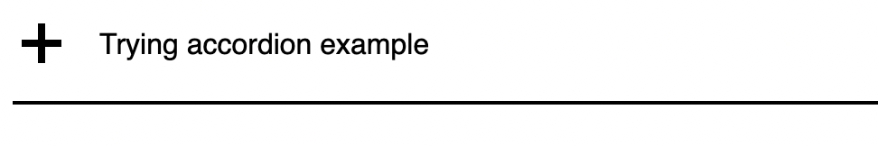

# components


[](https://socket.dev/npm/package/@nichoth/components)


A collection of UI components made with [preact](https://www.npmjs.com/package/preact) and [tonic](https://tonicframework.dev/).

[See a live demo](https://nichoth.github.io/components/)

## install
```
npm i -S @nichoth/components
```

## use
I recommend using this with [vite](https://www.npmjs.com/package/vite) + ESM, because it is easy. These are [preact](https://www.npmjs.com/package/preact) and [tonic](https://tonicframework.dev/) components; you will need to install `preact` or `tonic`.

The `preact` version is recommended, because some of the animations do not work well in the `tonic` version. In particular the `radio-group`, and `hamburger` components do not work well.

### preact + htm
Use preact with tagged template literals.

> [!IMPORTANT]  
> This is the preferred way to consume these, with `htm` + preact.

Import components from `@nichoth/components/htm/*`.

```ts
import { html } from 'htm/preact'
import { render, FunctionComponent } from 'preact'
import { TextInput } from '@nichoth/components/htm/text-input'
import '@nichoth/components/text-input.css'

const Example:FunctionComponent<{}> = function () {
    return html`
        <div>
            <h3>Text Input</h3>
            <${TextInput}
                displayName="htm text input"
                required=${true}
                minLength=${3}
                maxLength=${7}
                name=${'htm-text-input'}
            ><//>
        </div>
    `
}

render(html`<${Example}><//>`, document.getElementById('root')!)
```

### preact + JSX
Use preact with JSX

```tsx
import { render, FunctionComponent } from 'preact'
import { TextInput } from '@nichoth/components/preact/text-input'
import '@nichoth/components/text-input.css'

const Example:FunctionComponent = function () {
    return <div>
        <h3>Text Input</h3>
        <form className="example-form">
            <TextInput name="text" displayName="Input test" />
        </form>
    </div>
}

render(<Example />, document.getElementById('root')!)
```

### tonic
Use web components with [Tonic](https://tonicframework.dev/)

```js
import Tonic from '@nichoth/tonic'
import { SpinningButton } from '@nichoth/components/tonic/spinning-button'
import '@nichoth/components/text-input.css'

export class TonicExample extends Tonic {
    state = {
        isSpinning: false,
    }

    render () {
        return this.html`<div>
            <spinning-button
                isSpinning=${this.state.isSpinning}
                data-event="click-the-button"
            >
                click here
            </spinning-button>
        </div>`
    }
}

Tonic.add(SpinningButton)
Tonic.add(TonicExample)
```

## globals
We use these CSS variables

```css
:root {
    --transition-time: 0.2s;
    --button-outine-color: black;
    --button-primary-outline: #0077ff;
    --button-outine-primary-bg-hover: rgb(0 255 255 / 28%);
    --button-outline-disabled-ol: #0077ff5c;
    --text-input-error-border: red;
    --text-input-error-text: red;
    --hamburger-color: black;
    --fade-in-time: 0.2s;  /* for the mobile nav fade-in animation */
}
```

Define them in your application to customize.

## API

### css
Import the css variables in addition to the per-component css.

With Vite as bundler:
```js
import '@nichoth/components/variables.css'
```

### Switch
See [./src/htm/switch](./src/htm/switch.ts)

#### css
Affected by the transition variable.
```css
:root {
    --transition-time: 0.2s;
}
```

#### example
```js
import { html } from 'htm/preact'
import { Switch } from '@nichoth/components/htm/switch'
import '@nichoth/components/switch.css'

function Example () {
    return html`<div id="switch">
        <form
            onSubmit=${ev => {
                ev.preventDefault()
                const el = ev.target.elements['test-switch']
                console.log('el.checked', el.checked)
            }}>
                <${Switch} name="test-switch" />
                <button type="submit">submit</button>
        </form>
    </div>`
```

### checkbox
See [./src/htm/checkbox.ts](./src/htm/checkbox.ts)

Pass in the checkbox label as child text.

Optionally Pass in a signal as the checked value, to use as a controlled input. Or do not pass in a `checkedState` for a non-controlled input.

```js
const Checkbox:FunctionComponent<{
    checkedState?:Signal<boolean>;
} & JSX.HTMLAttributes<HTMLCheckbox>> = function (props)
```

#### example
```js
import { html } from 'htm/preact'
import { Checkbox } from '@nichoth/components/htm/checkbox'
import '@nichoth/components/checkbox.css'

function Example () {
    // note we pass in the checkbox label text as a child
    return html`<form onSubmit=${ev => {
        ev.preventDefault()
        const testbox = ev.target.elements.testbox
        console.log('testbox value', testbox.checked)
    }}>
        <fieldset>
            <legend>checkbox demo</legend>
            ${/* Can pass in `checkedState` here */}
            <${Checkbox} name="testbox">Testing checkbox<//>
        </fieldset>

        <button type="submit">submit</button>
    </form>`
}
```

#### css
CSS selectors:

```css
label.checkbox
```
and
```css
input.checkbox
```


### Accordion
Available in `preact/htm` only.

#### Accordion CSS
It is affected by the `--accordion-transition-time`, and `--x-transition-time` CSS variables

```css
:root {
    --accordion-transition-time: 0.4s;
    --x-transition-time: 0.2s;
}
```

#### example
```js
import { html } from 'htm/preact'
import { Accordion } from '@nichoth/components/htm/accordion'
import '@nichoth/components/accordion.css'

function Example () {
    return html`<${Accordion}>
        <summary>Trying accordion example</summary>
        <p>This is the nested paragraph element in the accordion demo</p>
    <//>`
}
```

Results in UI like this:

__closed:__


__open:__


### Button
Show resolving state with a spinner in the button. Either pass in a signal to
use as resolving state, or just return a promise from the `click` event handler.

### Button example
```ts
import { FunctionComponent } from 'preact'
import { html } from 'htm/preact'
import { useSignal } from '@preact/signals'
import { Button } from '@nichoth/components/preact/button'
const isResolving = useSignal(false)

const MyComponent:FunctionComponent = function () {
    return html`<Button
        isSpinning={resolving} ${/*<- note we are passing a signal, not boolean*/}
        onClick={clicker}
    >
        example
    </Button>`
}
```

### Button Outline
If you return a promise from the `onClick` event handler, then the button will spin until the promise resolves.

Takes an optional signal for `isSpinning`. To control the spinning state of the button, eg for a form submit, pass in a signal and update its value.

Looks for a few css variables:
```css
:root {
    --button-outine-color: black;
    --button-primary-outline: #0077ff;
    --button-outine-primary-bg-hover: rgb(0 255 255 / 28%);
    --button-outline-disabled-ol: #0077ff5c;
}
```

```ts
interface ButtonProps extends JSX.HTMLAttributes<HTMLButtonElement> {
    isSpinning?: Signal<boolean>,
    className?: string,
    onClick?: (ev:MouseEvent) => Promise<any>
}
```

#### example

```js
import { ButtonOutine } from '@nichoth/components/preact/button-outline'

<ButtonOutline
    type="submit"
    onClick={ev => {
        ev.preventDefault()
        console.log('click')
        // if you return a promise, then the button
        // will spin until it resolves
        return sleep(2000)
    }}
>
    example
</ButtonOutline>
```

### ButtonLink
A link that looks like a button. Use with `htm`.

```js
import { html } from 'htm/preact'
import { FunctionComponent } from 'preact'

/**
 * A link that looks like a button
 *
 * @param {HTMLAttributes<HTMLAnchorElement>} props
 * @returns {FunctionComponent}
 */
const ButtonLink:FunctionComponent<
    HTMLAttributes<HTMLAnchorElement>
> = function (props) {
    const className = [props.class, 'btn-link'].join(' ').trim()
    return html`<a href=${props.href} class=${className}>${props.children}</a>`
}
```

#### ButtonLink example
```js
import { html } from 'htm/preact'
import { ButtonLink } from '@nichoth/components/htm/button-link'
import '@nichoth/components/button.css'

// ...

return html`<div>
    <ButtonLink href="#" class="my-button">button text</ButtonLink>
</div>`
```

### CopyBtn
```jsx
import { CopyBtn } from '@nichoth/components/preact/copy-btn'

<CopyBtn payload="copying things">copy</CopyBtn>
```

### CopyIconBtn
```js
import { CopyIconBtn } from '@nicohoth/components/preact/copy-icon-btn'
// ...
<span>
    Copy this text
    <CopyIconBtn payload="copy this text" />
</span>
```

### Editable Field
```ts
interface Props extends JSX.HTMLAttributes<HTMLInputElement> {
    onSave:(value:string) => Promise<any>
    name:string
}

const EditableField:FunctionComponent<Props> = function EditableField (props)
```

```js
import { EditableField } from '@nichoth/components/preact/editable-field'
// ...
<EditableField
    name="editable-field"
    value="edit this"
    onSave={saver}
/>
```

### Text Input
This looks for 2 css variables:
```css
:root {
    --text-input-error-border: red;
    --text-input-error-text: red;
}
```

Pass in an attribute `title`; this determines the invalid hint text that is shown below the input.

```ts
interface InputProps extends JSX.HTMLAttributes<HTMLInputElement> {
    displayName: string;
    name: string;
    className?: string;
}

const TextInput:FunctionComponent<InputProps> = function (props:InputProps)
```

#### example
```js
import { TextInput } from '@nichoth/components/preact/text-input'
// ...
function MyElement () {
    return html`<form className="example-form">
        <${TextInput}
            displayName="htm text input"
            title="At least 3 characters, but less than 7"
            required=${true}
            minLength=${3}
            maxLength=${7}
            name=${'htm-text-input-example'}
        ><//>
    </form>`
}
```

### PencilBtn
```js
import { PencilBtn } from '@nichoth/components/preact/pencil-btn'
<PencilBtn onClick={(ev) => {
    // we are passed a `click` event
    ev.preventDefault()
    console.log('click')
}} />
```

### RadioGroup
```ts
interface Props {
    id?:string
    name:string
    legend:string
    options:string[]
    required:boolean
}

const RadioGroup:FunctionComponent<Props> = function (props)
```

```js
import { RadioGroup } from '@nichoth/components/preact/radio-group'

<RadioGroup
    name="test-radio"
    legend="testing radio group"
    options={['aaa', 'bbb', 'ccc']}
    required={true}
/>
```

### NumberInput
```ts
interface Props {
    name:string;
    min:number;
    max:number;
    value:Signal<number>;
    onIncrease?:(ev:MouseEvent)=>any;
    onDecrease?:(ev:MouseEvent)=>any;
    onChange?:(ev:JSX.TargetedEvent)=>any;
}

const NumberInput:FunctionComponent<Props> = function NumberInput (props)
```

```js
import { NumberInput } from '@nichoth/components/preact/number-input'

const count = useSignal(3)
// ...
<NumberInput
    min={0}
    max={7}
    name="test-input"
    value={count}
    onIncrease={() => {
        console.log('increase')
    }}
    onDecrease={() => {
        console.log('decrease')
    }}
/>
```

### ReactiveForm
A `form` element that uses HTML attributes to check validity, and enables or
disables the submit button as appropriate.

```ts
type Props = {
    onInput?:(event:InputEvent)=>any;
    onSubmit:(event:SubmitEvent)=>any;
    controls?:boolean;
    buttonText?:string;
} & Readonly<Attributes & {
    children?: ComponentChildren
}>

const ReactiveForm:FunctionComponent<Props> = function (props:Props)
```

```js
import { ReactiveForm } from '@nichoth/components/preact/reactive-form'

<ReactiveForm
    onSubmit={async (ev:SubmitEvent) => {
        ev.preventDefault()
        const text = ((ev.target as HTMLFormElement)
            .elements
            .namedItem('text') as HTMLInputElement)

        await sleep(2000)

        console.log('resolved...', text.value)
    }}
>
    <TextInput
        required={true}
        displayName="text input"
        name="text"
    />
</ReactiveForm>
```

## example

```js
import { render } from 'preact'
import { useSignal } from '@preact/signals'
import HamburgerWrapper from '@nichoth/components/preact/hamburger'
import MobileNav from '@nichoth/components/preact/mobile-nav-menu'
import { CopyBtn, CopyIconBtn } from '@nichoth/components/preact/copy-btn'
import '@nichoth/components/variables.css'
import '@nichoth/components/copy-btn.css'
import '@nichoth/components/hamburger.css'
import '@nichoth/components/mobile-nav-menu.css'
import '@nichoth/components/z-index.css'

const App = function App () {
    const isOpen = useSignal(false)

    function mobileNavHandler (ev) {
        ev.preventDefault()
        isOpen.value = !isOpen.value
    }

    return <div class="app">
        <HamburgerWrapper isOpen={isOpen} onClick={mobileNavHandler} />
        <MobileNav isOpen={isOpen}>
            <a href="/baloney">baloney</a>
            <a href="/test">testing</a>
        <//>

        <CopyBtn payload="hurray">copy something</CopyBtn>

        <p>Copy this <CopyIconBtn payload="Copy this" /></p>
    </div>
}

const el = document.getElementById('root')
if (el) render(<App />, el)
```

### css
We look for a css variable `--hamburger-color`, or by default use a black color. 

```css
/* in your css file */
:root {
    --hamburger-color: #FAFAFA;
}
```

### see also

* [You don't need JavaScript for that](https://www.htmhell.dev/adventcalendar/2023/2/)
